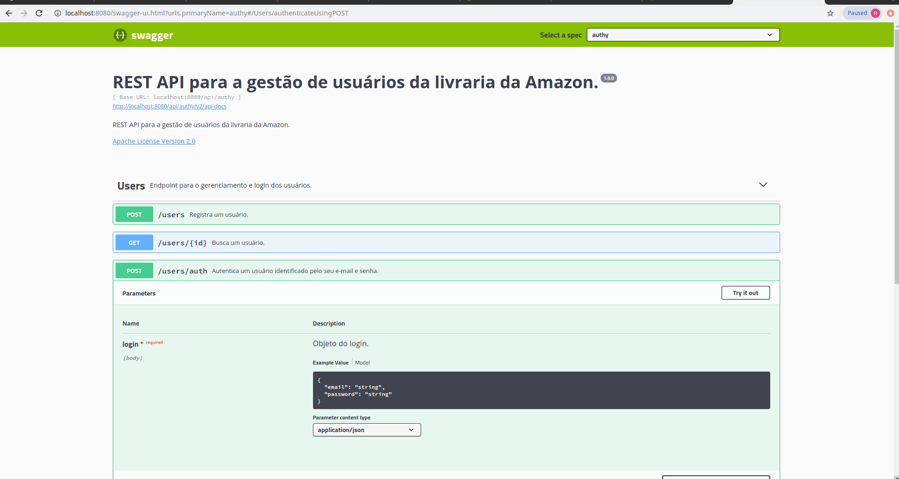

# amazon-api-gateway

API gateway para acesso as APIs da livraria da Amazon.

## Desenho do sistema

Abaixo esta o desenho do sistema, baseado na documentação gerada pelo Swagger2 para cada microserviço disponível.

Para acessar a documentação é necessário ter todos os serviços rodando e em seguida basta acessar: http://[IP]:8080/swagger-ui.html

## 11 regras utilizadas para desenhar as APIs.

### APIs organizadas ao longo de recursos
As APIs foram organizadas com base em recursos. Por exemplo: books, basket, comments e users.

### APIs padronizadas
As APIs foram padronizadas, utilizando substantivos no plural para URIs que fazem referência à coleções e singular para as demais. Exemplo:
 - /v1/public/users
 - /v1/public/books
 
### APIs projetadas para mapear entidades de negócio e suas operações
 - /v1/public/users/auth
 - /v1/books/{isbn}/comments
 
### APIs simples
Os recursos que envolvem coleções foram limitados ao padrão de coleção/item/coleção.
- /v1/books/{isbn}/comments
 
### Atualização em lote para operações complexas
Não foi necessária a implementação.

### Padrão ISO 8601 para os atributos de data/hora
Os recursos que possuem atributos de data/hora utilizam o formato yyyy-MM-ddTHH:mm:ss.
- POST /v1/public/users/auth
- POST /v1/public/books

### APIs documentadas
As APIs foram devidamente documentadas utilizando o Swagger2. Para consultar a documentação de um serviço especifico, acesse http://[IP]:[PORT]/v1/public/swagger-ui.html

### Utilizar o protocolo HTTPS/SSL
Em produção, o servidor de aplicações deverá ser configurado com um certificado válido para permitir acesso às APIs utilizando o protocolo HTTPS.

### APIs versionadas
A URI básica da API é baseada no versionamento da mesma: /v1/public/* 

### Utilizar paginação para coleções com grandes volumes
Coleções de livros e comentários são obtidos parcialmente através de páginas. Além dos resultados, a API retorna a página atual, quantidade total de itens, quantidade de itens que foram retornados e a quantidade de itens pulados.
 - /v1/public/books?isbn=SA8763&limit=10&offset=5
 - /v1/public/books/SA8763/comments?limit=10&offset=5

### Utilização os códigos HTTP
 - 200 (OK) Quando os recursos são encontrados ou autorizados com sucesso.
   - POST /v1/public/users/auth
 - 201 (Created) A solicitação foi bem sucedida e um novo recurso foi criado.
   - POST /v1/public/users
 - 404 (Not Found) O usuário requisitado não pôde ser encontrado.
   - POST /v1/public/users/auth
 - 405 (Method Not Allowed) O método especificado na requisição não é permitido.
   - GET /v1/public/users
